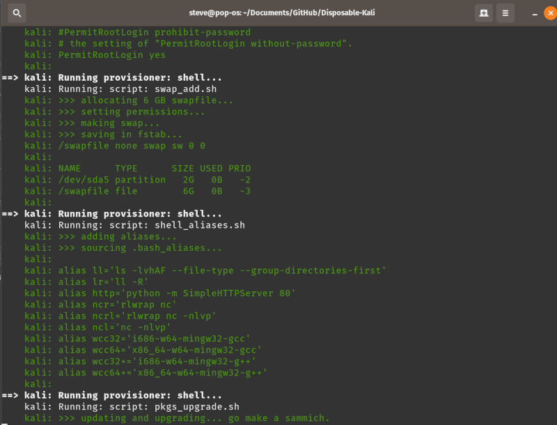

# Disposable-Kali                                          

This project contains a vagrant file that spins up a Kali virtual machine (using Virtual Box) with a configurabe list of customizable modifications such as:



- adding swap space
- setting BASH aliases
- adding extra wordlists
- installing wine
- update & dist-upgrade
- prepping metasploit
- cloning useful git repos like AutoBlue and AutoRecon
- installing common exploit dependecies and mingw
- setting up UFW

## Prerequisites

You'll need to have the following ready before you can use this:

- [VirtualBox 6](https://www.virtualbox.org/) installed and working
- [Vagrant 2.x](https://www.vagrantup.com/) installed and working 

## Installing

- Clone this repo or simple download the [Vagrantfile]() to a directory
- Navigate to the directory, open Vagrantfile in your favorite editor to review/customize settings
- From a command shell, start the VM.  The first time this runs will take some time doing provisioning.

```
vagrant up
```

- Vagrant will download the base Kali box, configure the VM in virtualbox, run provisioning scripts.  The first time this runs this can take some time but should not require any interaction.

- Login, change the root password and use Kali!

```
vagrant ssh
```

## Usage
You can use your VM headless or open the virtualbox gui and attach to the running vm to login with a graphical UI.  X11 forwarding is an option in the Vagrantfile for headless usage, easier if your host is linux.

Common VM lifecycle
```
#start vm
vagrant up

#login
vagrant ssh

#stop the vm
vagrant halt

#when you want to start with a clean install
vagrant destroy
vagrant up
```

## Contributing

Please fork and create an issue describing the changes to be merged.

## Authors

* **Steve Mcilwain** - *Initial work* - [stevemcilwain](https://github.com/stevemcilwain)

See also the list of [contributors](https://github.com/stevemcilwain/Disposable-Kali/graphs/contributors) who participated in this project.

## License

This project is licensed under the MIT License - see the [LICENSE](LICENSE) file for details
